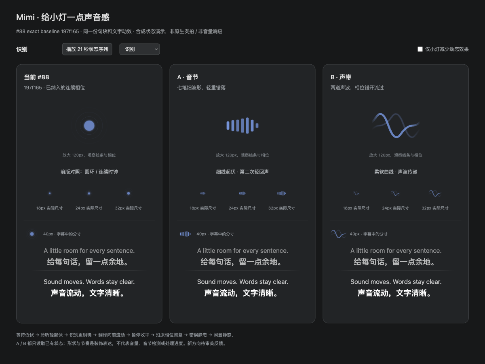

# A syllable / B ribbon — approved sound-style preview

The user explicitly chose to keep both styles as selectable, persistent options
on 2026-09-30. The existing light remains the default/recoverable `classic`.
Source candidate `d72d5be917f9b7e58719e53ec30e2d743dc94305`, parent exact
integration `197f165446e802b1fa4d3717142c4cf626142b3e`; independently adapted
into integration `8fc0fa64504545bea6e9f0a2e88288911b6dd1b2`. This evidence-only
branch contains no application changes, user credentials or captured audio.

These are original actual Mac browser React/CSS component recordings with
synthetic bilingual text and the existing seven session phases. Three columns
are the previous light, candidate A syllable and candidate B ribbon; all share
the same Timeline/fonts/canvas. Neither file shows the new Settings selector,
installed native/Linux packages, measured volume or provider response. The
image's “review pending” footer describes capture-time state, not the later
user decision. Old defaults in the source preview note are superseded by the
explicit instruction to retain both choices and preserve prior preferences.

[Original video](sound-directions.mp4): 1440×1080 H.264 MP4, 22.042 seconds.
977 original CDP JPEG samples, source span19.066519s, mean51.189208samples/s;
original static/pause/error gaps and final2.974835s retained. Two out-of-order
events sorted by original timestamps; variable-frame-rate encoding with no
interpolation, speed-up, generated in-between frames or native/fixed60fps claim.
The source worker played the video to its end and sampled recognize/translate/
pause/resume/error; the user watched before choosing both styles.

SHA256 originals copied and independently checked:

- PNG `9c2ed60ec23b0904aa65ba9742f343bdc0dfeb42829c0b43014442372d5a4d3d`
- MP4 `c54c775a1f04cb187293519554d53fd77da642429daeca653f4a069bd994bf32`

Source browser checks report 11 persistent tracks per candidate through active
phase changes, paused clocks unchanged after pending commands resolve, same
instances continuing on resume, and zero running animations for off/system
reduced motion. Integration adds the real persisted setting and broadcast;
its full CI and installed-package acceptance are separate. Existing 18/40px
bounds, #67 text motion and independent motion preferences stay.

Acceptance pending: the exact new package's Settings preview/selector, cross-
window selection and restart persistence, all styles in overlay, system reduced
motion, platform SVG masks and new screenshots. No real audio/provider test,
native Mac launch, merge or release follows from this browser material.
