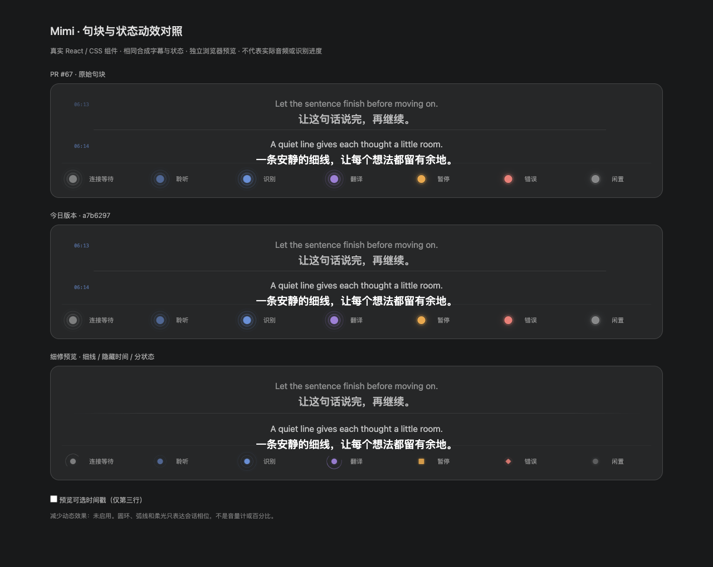

# 字幕句块细修：公开预览证据

Refs #67, #87, #88。只保存现有安全合成预览，不含实现改动、密钥、用户字幕、录音或安装包。

图中三行依次为：

1. **PR #67 Timeline 源文件**，`3128c46c0c594aaa1cd899c2dd5630182ac3154c`；支持模块、字体和画布来自下述本地 baseline。
2. **本地 baseline** `a7b6297b77ace6d15090dc04e7f7c6b6d547bae1`。图内“今日版本”指该本地分支，不是 main 或 #88。
3. **细修候选** `113a3408782bf7c635ba703f24b4b4fede053094`，基于本地 baseline。图内“细修预览”不是 #88 最终包。

三者使用同一画布、主题和合成双语句子，运行真实 React/CSS 组件，覆盖连接等待、聆听、识别、翻译、暂停、错误、闲置。此图不是完整 PR67 原生窗口，也不是 main `d190877` 与集成包的精确 before/after。baseline 的 translationFirst、hover、timestamp-alpha、presentation helper、scroll-continuity 还未全部在 main/#88，因此只能按 hunk 移植候选；不应整条合并本地历史。

[原尺寸静态图](comparison-hd.png) · [实际组件短视频](comparison-motion.mp4)

视频 8.04 秒，1920×1530；原始采样时序约 5–6 fps。实现者实际播放 2 秒和 5 秒位置检查。状态为合成输入，圆环/弧线只表达会话相位，不测量音量或识别进度。浏览器减弱动态效果检查中候选七状态均无运行中动画；组件可选时间恢复两个时间戳。

保留 #67 贡献者的句块、文字渐入、定稿不重播入场、年龄淡出与行预算。统一圆环节奏更早由 `2795365` 引入，不能归责于 #67。候选线条、默认隐藏时间与不同相位动效仍待用户视觉确认；当前只在 #88 纳入受控验收。

未验：集成包签名原生窗口、实际音频/付费服务、系统采音、重装钥匙串认证。未重新编译、启动浏览器或应用来生成本次发布素材。原素材来自 2026-09-30 task15 已结束的独立浏览器预览；图像经整合者只读核对。

## 回归步骤（后续协调执行，不在当前 GUI 冻结期间运行）

同尺寸、主题和合成句子检查：双语/原文/译文切换、长句预算、定稿、老句淡出、沉浸模式无分隔线；分别关闭两项动效、系统减少动态效果以及显式偏好覆盖；七相位与收起/展开；默认隐藏时间、`showTimestamps` 恢复。真正集成包必须再拍同场景前后图，不能用这里的共享画布代替。
