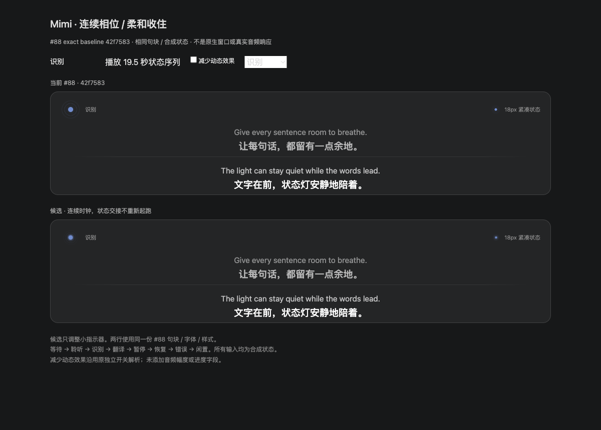

# Mimi 连续状态动画：集成候选证据

Refs #87、#88。用户已观看实际动效并确认允许公开贴入集成验收；这不是最终安装包验收、合并或发布许可。

[原始实际组件视频（MP4）](phase-continuity.mp4)

## 版本和条件

- 来源候选 `3fb46654e7a3d4f053462e71c61ad5b6987f6d2e`；仅 PulseRing.tsx、专用 PulseRing.css 和证据 note，已作为独立提交移植到 #88 `259bce16902b48f73ae1debc404d94ad51908259`，并非合入 task15 旧历史。
- 参考版本为当时 #88 的精确 `42f758378e0d2b47bc65922ac105f0907f5a62f1`。录制后 DeepLX 整合 `fcdc1a985d245e4380522615af32bdbe1f5b9dc3` 的 PulseRing/Timeline/index.css 与该参考完全相同，经整合者 git diff 核对。
- 实际 Mac 上的 Chromium 浏览器组件运行，同一个画布、尺寸、主题、baseline Timeline/字体/样式、合成双语字幕与现有七种会话状态。上行为参考指示器源码，下行为候选；同时包含40px与18px紧凑指示器。
- 高清图与视频为原文件，没有重新绘图、插帧或改速。不是 native 整窗，不是 Linux 安装包实拍，也不是真实音频/识别进度。

## 实际时序材料

H.264/avc1 MP4，1440×1032，20.445 秒。录制方记录1016原始CDP帧；首末变动画面跨度17.556秒，平均57.814fps，静止gap及末尾2.887秒保持原时长；两晚到帧按原时间戳排序。不宣称固定60fps或原生平台帧率。

顺序为等待连接、聆听、识别、翻译、暂停、恢复识别、错误、闲置。实现者实际播放并检查识别/暂停/恢复；父线程和用户已观看。整合者只读核对静态图、MP4 container结构、尺寸/时长/codec以及Library下载和原文件一致的SHA256，没有重启预览。

七个CSS animation实例在活跃相位之间保留身份；只切换层的可见性/形状，480ms过渡。暂停/错误/闲置520ms后暂停时钟；恢复续时。motionEnabled=false立即静止，保持既有独立偏好解析，不增加音量/进度字段。#67句块、定稿稳定、文字渐入和年龄淡出未改。

## 已测与待测

录制方：typecheck、组件eslint、diffcheck通过；实际浏览器七animation实例在识别/翻译切换中不变；await animation.ready 后七clock在暂停450ms内不变，恢复同实例续时；显式关闭与系统reduce均running0。

新集成head须远程完整CI复核；本文件不把来源组件检查当作集成完整check。Linux安装包的exact-head UI-only、signed WebKit、紧凑/展开/空态/暂停/错误/长字幕、真实音频/付费服务均待验。当前nativeGUI/安装冻结保持，不以Mac浏览器视频冒充Linux通过。未merge/tag/release/deploy。

后续回归：同尺寸背景主题重演状态序列，检查相位不重启、暂停慢收住、恢复连续；40/18px、减少动态效果、两个独立开关分别关闭及显式覆盖；确认#67文字动效和其他设置/面板保持。Linux包另用准确集成commit与artifact hash记录安装/启动步骤和原生截图，冻结解除前不执行。
