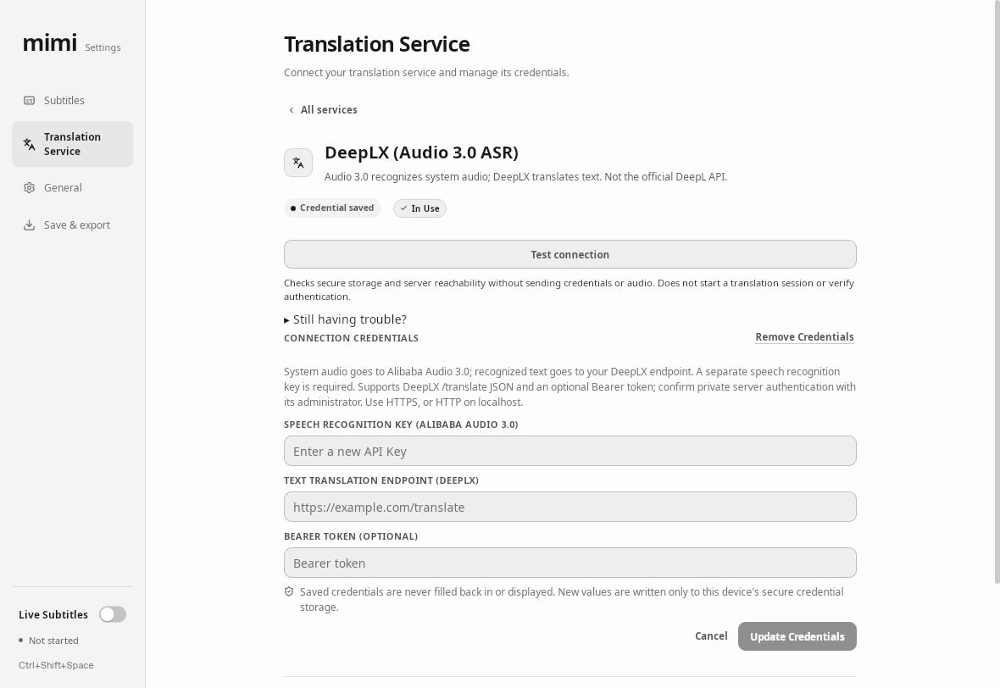
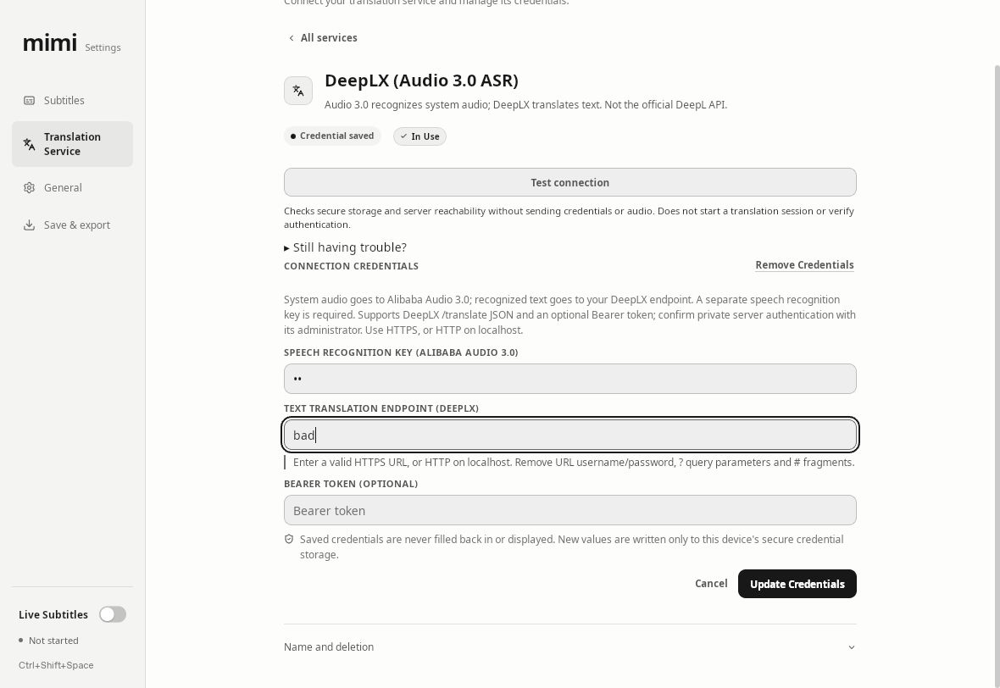

# PR #73: Linux DeepLX endpoint error regression

Related: [PR #73](https://github.com/yuxino/mimi/pull/73), [issue #70](https://github.com/yuxino/mimi/issues/70).

These are original screenshots of the native Linux AppImage in an isolated QA desktop, not renderings or browser mockups. Both captures use English, a 1180 × 812 window, an already configured and active DeepLX profile, and **Update Credentials**. They do not demonstrate first-time Save and Use. The Linux build target is Ubuntu 22.04; the screenshots establish native Linux GUI behavior, not physical hardware or every Linux desktop environment.

| Evidence | Exact application build | CI artifact |
| --- | --- | --- |
| Before | `367013c4fcb1edc6eb41967975963de08c5ef94c` | [`11082183921`](https://github.com/yuxino/mimi/actions/runs/36682562795/artifacts/11082183921) |
| After | `8437b9be385a85877f341b3b5e4d9b740b0856c8` | [`11083398960`](https://github.com/yuxino/mimi/actions/runs/36685163718/artifacts/11083398960) |

## Same-condition reproduction

1. Launch the respective AppImage with isolated test configuration and Secret Service/keyring. Configure a DeepLX profile using synthetic ASR value `qa`, a loopback endpoint, and no token; activate it. Do not start Live Subtitles.
2. Open Translation Service → the active DeepLX profile → Update Credentials.
3. Enter synthetic ASR value `qa`, endpoint `bad`, and leave the optional token empty. Start with the page at the top of the 1180 × 812 window.
4. Click Update Credentials. Capture the resulting native window without manually scrolling.

Expected after the fix: the endpoint retains `bad`, the masked synthetic ASR input remains, a short actionable error appears directly below the endpoint, and focus/automatic scrolling brings that error into view. The existing saved profile is retained.

Before: the backend rejected the invalid endpoint, but all draft fields were cleared and the error was below the viewport after the secondary name/deletion controls. There was no visible feedback in the captured viewport. This was a feedback/draft-retention defect, not acceptance of an invalid URL.

### Before — draft cleared; error outside viewport

### After — draft retained; nearby error automatically brought into view

The different resulting scroll positions are part of the behavior under test: the fixed build scrolls automatically; the old build leaves the error below the viewport.

## Regression checklist and verification boundary

- [x] `bad` and `not-a-url`: clear adjacent validation, retained unsaved inputs, focused endpoint and automatic scroll on the fixed build.
- [x] Correcting the endpoint to a valid loopback address clears the error immediately.
- [x] Empty optional token saves successfully; the synthetic profile survives app/keyring restart.
- [x] Exact fixed-head CI passed all nine validation jobs; release/publish jobs were skipped.
- [ ] Real private-host authentication and translation were **not tested**. The configured loopback destination and synthetic key do not establish private server compatibility.

No real key, token, user audio, or user transcript is included. Live Subtitles was not started. The ASR input in the after screenshot is the masked synthetic string `qa`. Screenshots are published on a separate evidence branch so the implementation head remains `8437b9b`; this evidence publication does not authorize merging or releasing PR #73.

Original image SHA-256:

- Before: `841c6814add560c54e9d7d873b408c593646d5ebb460548bda6258e0237fe27b`
- After: `33fd90c6ad16461966f3c7fa13a101bf531556bd47f961c11b30be4a86d885db`
